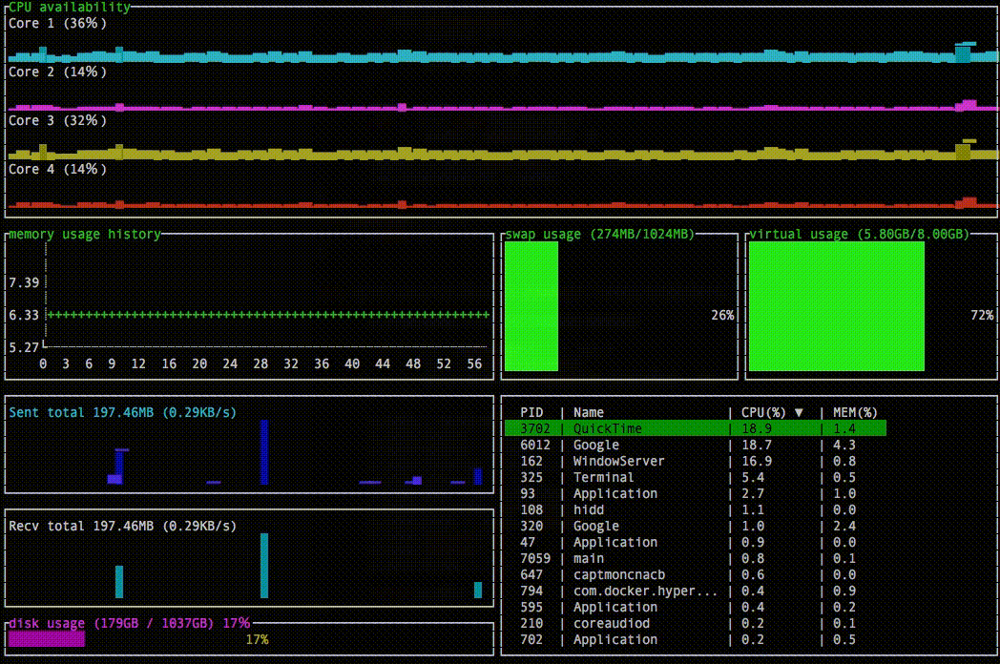

# gotop

The gotop is a system monitoring dashboard for terminal console.   
   
Developed with reference to the [gtop](https://github.com/aksakalli/gtop), I got inspiration hints. Thank you [@aksakalli](https://github.com/aksakalli).   
The gotop is reimplement gtop with golang. So gotop is lightweight and quick.   
gtop looks better, gotop does looks bad but it is light.   

# Requirements
- OSX, Linux supported
- go >= 1.9

# todo
- [ ] select process and execute kill
- [ ] dynamic height change.
